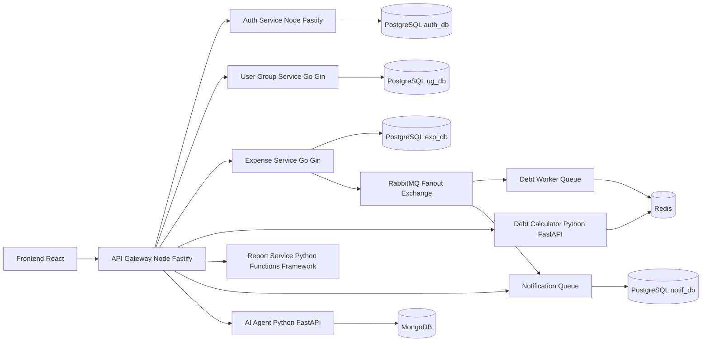

# SplitEasy

SplitEasy es una plataforma para gestionar gastos compartidos entre grupos. La entrega queda organizada como una arquitectura de microservicios asincronicos con API Gateway, frontend unico, broker de mensajeria, persistencia por servicio y un agente de IA.

## Integrantes

- Cesar Andres Guzman
- Juan Diego Velasco
- Rossibel Daniela Ibarra

## Arquitectura



## Microservicios

| # | Servicio | Tecnologia | Base de datos | Puerto | Responsabilidad |
| --- | --- | --- | --- | --- | --- |
| 00 | API Gateway | Node.js + Fastify | Redis opcional | 8080 | CORS, JWT, rate limit y proxy hacia servicios |
| 01 | Auth Service | Node.js + Fastify | PostgreSQL | 3001 | Registro, login, access token JWT y refresh token opaco |
| 02 | User & Group Service | Go + Gin | PostgreSQL | 8082 | Perfiles, grupos, miembros y roles |
| 03 | Expense Service | Go + Gin | PostgreSQL | 8081 | Gastos, splits y publicacion de eventos |
| 04 | Debt Calculator | Python + FastAPI | Redis | 8000 | Balances y plan optimo de liquidacion |
| 05 | Report Service | Python + Functions Framework | Stateless | 8083 | Reporte serverless bajo demanda |
| 06 | Notification Service | Node.js + Fastify | PostgreSQL | 3006 | Notificaciones REST y consumo de eventos |
| 07 | AI Agent Service | Python + FastAPI | MongoDB | 8007 | Chat sobre balances, gastos y planes de pago |

## Flujo principal

1. El usuario entra por el frontend en `http://localhost:5170`.
2. El frontend consume solamente el API Gateway en `http://localhost:8080/api`.
3. Auth emite `access_token` JWT y `refresh_token` opaco en cookies `HttpOnly`.
4. El Gateway valida el JWT y enruta a cada microservicio.
5. Expense guarda el gasto y publica `expense.created` en un exchange fanout de RabbitMQ.
6. Debt Worker consume su propia cola, recalcula balances y guarda el resultado en Redis.
7. Notification Service consume su propia cola y guarda notificaciones.
8. Report Service genera reportes bajo demanda sin base de datos propia.
9. AI Agent consulta balances y gastos para responder preguntas del grupo.

## Bases de datos

Auth Service:
- `users(id, name, email, password_hash, created_at, updated_at)`
- `refresh_tokens(id, user_id, token_hash, expires_at, revoked, created_at)`

User & Group Service:
- `profiles(id, display_name, avatar_url, created_at)`
- `groups(id, name, description, created_by, created_at)`
- `group_members(id, group_id, user_id, role, joined_at)`

Expense Service:
- `expenses(id, group_id, paid_by, amount, description, created_at)`
- `expense_splits(id, expense_id, user_id, amount_owed, paid, settled_at)`

Notification Service:
- `notifications(id, user_id, type, message, group_id, group_name, amount, read, created_at)`

Debt Calculator:
- Redis `balances:{group_id}` para saldos netos.
- Redis `debts:{group_id}` para el plan optimo.

AI Agent:
- MongoDB `ai_agent_db.chat_logs` para historial de preguntas y respuestas.

Report Service:
- Stateless. Consulta Expense y Debt en tiempo real.

## Documentacion complementaria

- Requisitos funcionales: `docs/REQUISITOS_FUNCIONALES.md`
- Modelo de datos: `docs/MODELO_DATOS.md`
- Despliegue: `docs/DESPLIEGUE.md`

## Ejecucion

Requisitos:
- Docker Desktop
- Docker Compose

Comando principal:

```bash
docker compose up --build
```

URLs:
- Frontend: `http://localhost:5170`
- API Gateway: `http://localhost:8080`
- Health general: `http://localhost:8080/api/health`
- RabbitMQ Management: `http://localhost:15672` con usuario `guest` y clave `guest`

Para detener:

```bash
docker compose down
```

Para borrar volumenes y reiniciar bases de datos:

```bash
docker compose down -v
```

## Pruebas

Pruebas por servicio:

```bash
cd SplitEasy-feature-auth-service/auth-service
npm test
```

```bash
cd SplitEasy-feature-expensive-service/expense-service
go test ./tests/...
```

```bash
cd SplitEasy-feature-user-group-service/user-group-service
go test ./tests/...
```

```bash
cd SplitEasy-feature-debt-calculator-service/debt-calculator-service
pytest
```

```bash
cd SplitEasy-feature-report-service/report-service
pytest
```

```bash
cd api-gateway
npm test
```

```bash
cd ai-agent-service
pytest
```

## Seguridad

- El access token es JWT y expira rapido.
- El refresh token es opaco, se guarda hasheado y puede revocarse en logout.
- Las cookies son `HttpOnly`.
- El Gateway centraliza CORS, rate limit y validacion JWT.
- Los servicios pueden seguir vivos aunque otro servicio falle; el Gateway devuelve `503` controlado cuando un upstream esta caido.
